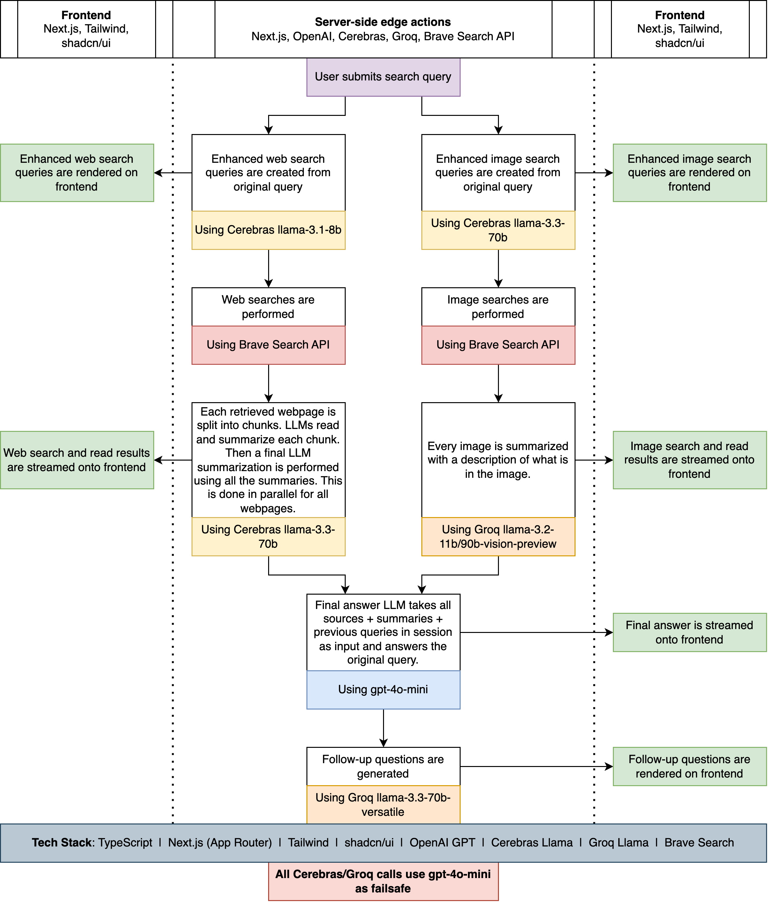

# Omniscient AI

Omniscient AI is an AI search engine.

- [Visit deployed website here.](https://omniscient-ai.pranavramesh.com/)
- [See demo video here.](https://youtu.be/b_iaNQ20SlM)

## 🌟 Features

- 🔍 **Smart Search Query Optimization**: 
  - Primary: Cerebras (llama-3.1-8b)
  - Fallback: OpenAI (gpt-4o-mini)
  - Automatically refines your search queries for better results

- 🌐 **Comprehensive Web Search**: 
  - Brave Search API for web results
  - Custom webscraping with HTML-to-Markdown conversion
  - Searches multiple sources and scrapes relevant content

- 🖼️ **Intelligent Image Search**: 
  - Primary: Cerebras (llama-3.3-70b) for query optimization
  - Brave Search API for image results
  - Groq (llama-3.2-11b/90b vision models) for image descriptions
  - Automatically determines when images would be helpful and includes relevant visual results

- 📝 **Detailed Content Summaries**: 
  - Primary: Cerebras (llama-3.3-70b/3.1-70b) for chunk processing
  - Fallback: OpenAI (gpt-4o-mini)
  - Generates focused summaries of web content based on your query

- 🤖 **AI-Powered Synthesis**: 
  - OpenAI (gpt-4o-mini) for final answer generation
  - Provides comprehensive answers by combining information from multiple sources

- 🔄 **Follow-up Questions**: 
  - Primary: Groq (llama-3.3-70b-versatile)
  - Fallback: OpenAI (gpt-4o-mini)
  - Generates relevant follow-up queries to explore topics further

- 💬 **Session Management**: 
  - Groq (llama3-8b-8192) for session title generation
  - Maintains separate chat sessions with custom titles

- ⚡ **Real-time Updates**: Shows search and processing progress as it happens

- 🎯 **Source Attribution**: Clearly links to and credits original sources

- 🔄 **Parallel Processing**: Efficiently processes multiple search results simultaneously



## 🚀 Getting Started

### Prerequisites

- Node.js 22.x or higher
- pnpm package manager

### Installation

1. Clone the repository.
2. Install dependencies using `pnpm install`.
3. Create a `.env` file with the following format:

```env
OPENAI_API_KEY=...
GROQ_API_KEY=...
GROQ_API_KEY2=...
GROQ_API_KEY3=...
CEREBRAS_API_KEY=...
CEREBRAS_API_KEY2=...
CEREBRAS_API_KEY3=...
BRAVE_API_KEY=...
```

### Running locally

```
pnpm run dev
```

### Libraries used

- **Next.js 15**: React framework for production-grade applications
- **React 19**: JavaScript library for building user interfaces
- **shadcn/ui**: Collection of reusable UI components built with Radix UI and Tailwind CSS
- **Tailwind CSS**: Utility-first CSS framework
- **OpenAI SDK**: Interface with OpenAI's API
- **Groq SDK**: Integration with Groq's API
- **Cerebras SDK**: Integration with Cerebras AI models
- **Brave Search API**: Web search functionality through Brave's API
- **React Markdown**: Markdown rendering with support for:
  - Math equations (KaTeX)
  - GitHub Flavored Markdown
  - MathJax rendering
- **UUID**: Unique identifier generation
- **Zod**: TypeScript-first schema validation
- **Axios**: Promise-based HTTP client